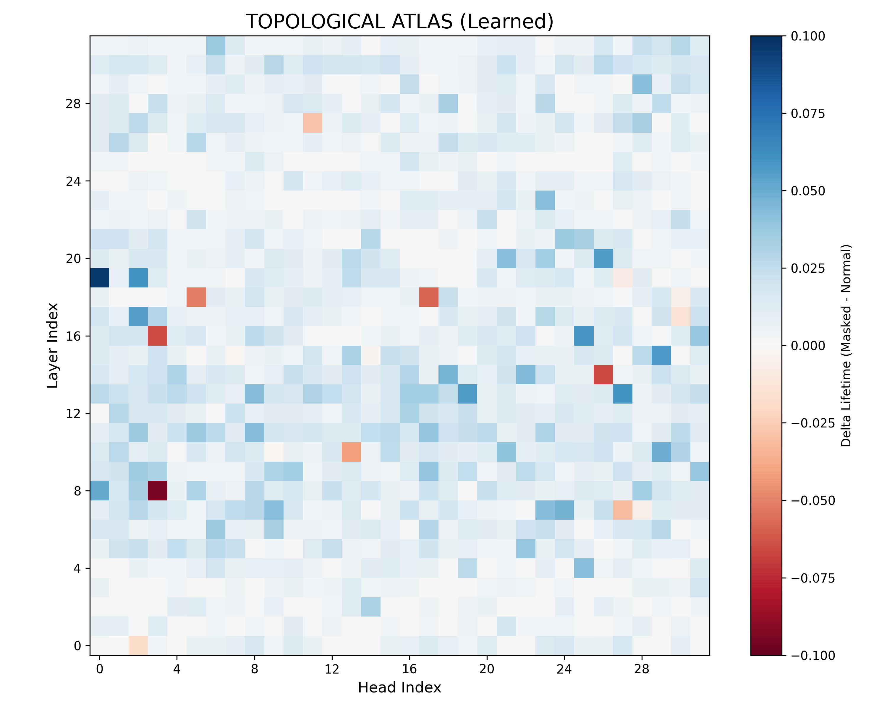
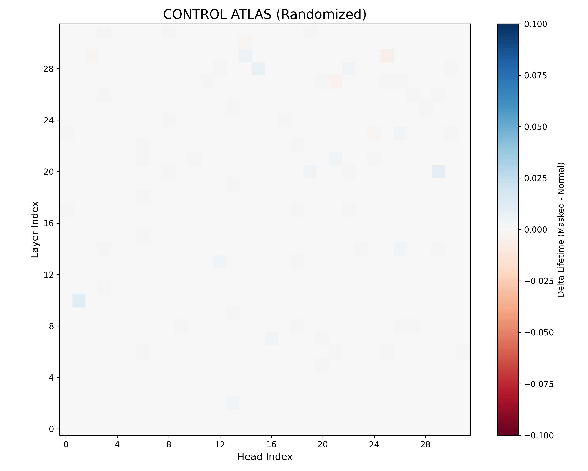
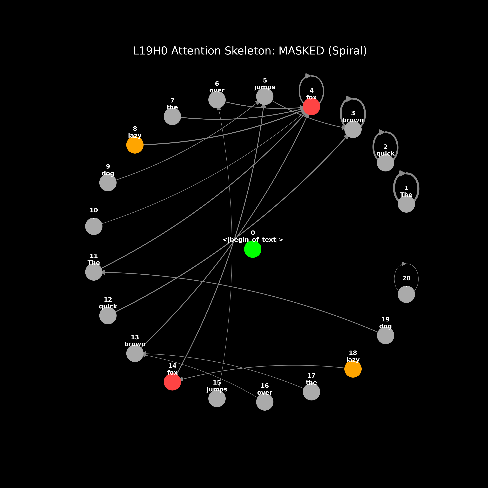
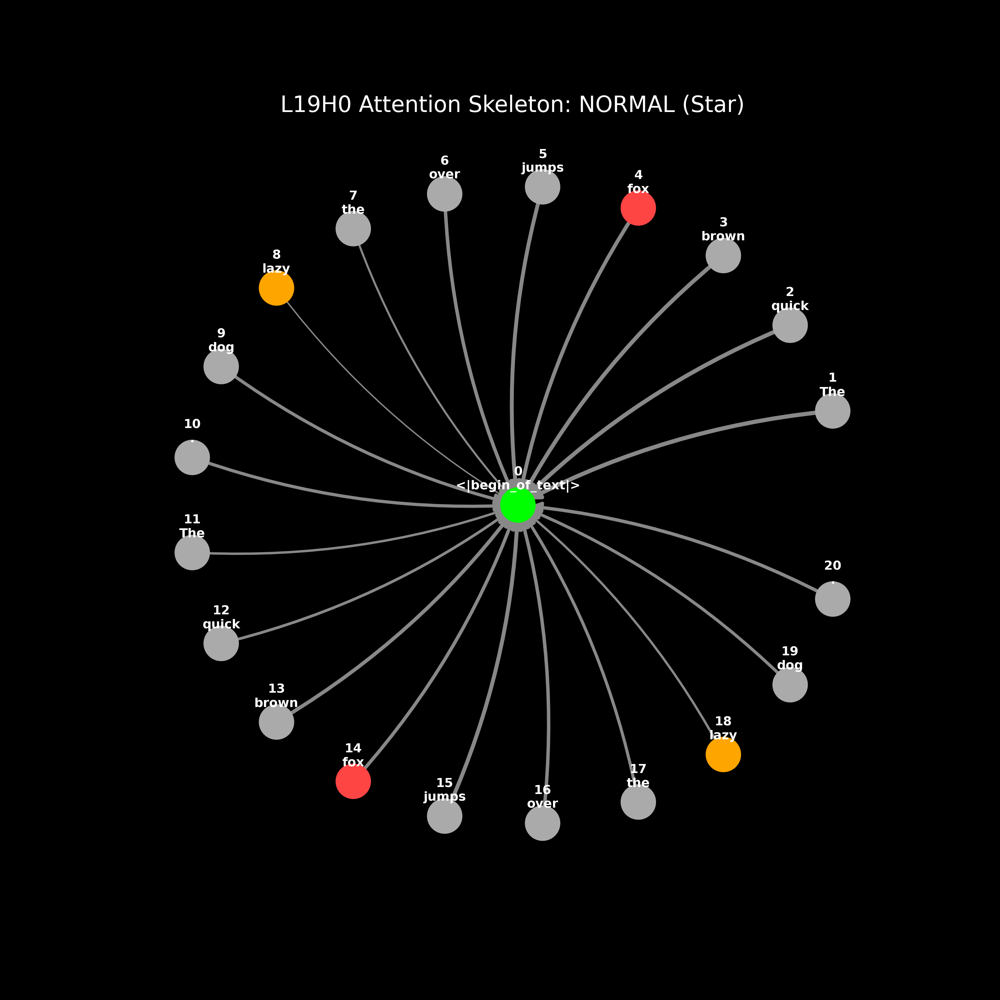
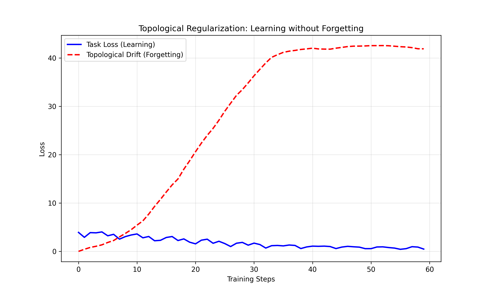
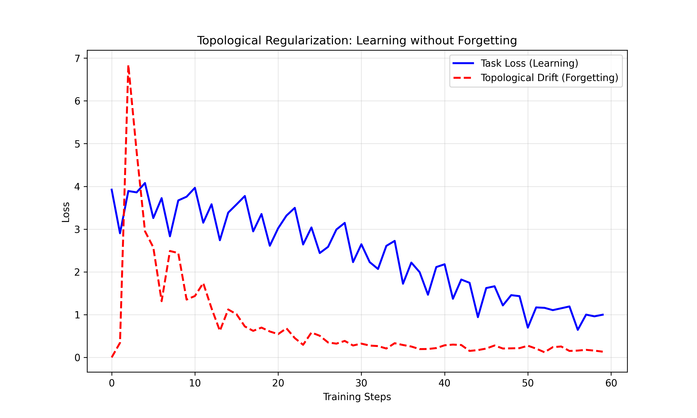

# Attention Sinks Play Topologically Important Roles in Current LLM Architecture
## Abstract
The "Attention Sink" is the phenomenon where Large Language Models 
(LLMs) allocate a disproportionate amount of attention probability
to the [BOS] token [1]. The consensus is that the sink is an artifact
required for Softmax stability. Recent innovations in architecture,
such as Gated Attention, show that the sink can be eliminated safely
and doing so improves context utilization [1]. This raises the question
for the other 99% of models still using old Softmax architecture.
If the sink is forced by the architecture, does the model ignore 
it, or co-opt it? Using Topological Data Analysis (TDA), it's 
demonstrated that current, standard Transformers repurpose
the attention sink into a necessity. I identified two different 
topological roles for the attention sink:

- It's a bridge that closes $H_1$ cycles to maintain global 
context coherence
- It's a cone that suppresses latent induction spirals

In better detail, removing the sink in deep layers reveals a
pattern of "Next-Token Induction," where the model attends to the
next token of a previous occurrence (e.g. quick $\to$ brown). It
also demonstrated that Catastrophic Forgetting can be framed as 
the topological collapse of the identified structures during 
fine-tuning. As a fix, I introduced Topological Regularization, a
targeted loss function that can preserve the geometry of these
structures. Through this function, I was able to demonstrate its
effectiveness in preventing CF during LoRA fine-tuning, proving
that current architecture has at least some sort of use for the
attention sink other than being a trash bin.

Note: LoRA fine-tuning was in 4-bit due to hardware constraints.

## Introduction
The geometry of context in LLMs is dictated by the attention
mechanisms. In standard transformers, the Softmax function enforces
a normalization constraint ($\sum A_{i,j} = 1$) and it compels the
model to allocate probability mass even when there is no relevant
token. It's this constraint that forces the creation of an
"Attention Sink" at Token 0 (often [BOS]) and is usually dismissed
as a near-useless artifact caused by the Softmax function [2].

This is confirmed by recent work on Gated Attention. By introducing
a non-linear gating mechanism, the sink is safely removed, yielding
models that distribute attention evenly [3]. However, the majority of 
models still in use today still rely on Softmax architecture without
this mechanism.

In these standard models, I hypothesize that the attention sink is
a byproduct of the architecture that the model has learned to rely
on for structural integrity. In specific, I investigate whether the
sink acts as a homological hub that organizes the attention graph
topologically.

## Methodology
I analyzed Llama-3.1-8B-Instruct using Persistent Homology. 

#### TDA Pipeline
The attention matrix $A$ of each head is treated as a weight
directed graph. This is converted to a metric space using the 
distance $D_{ij} = 1 - A_{ij}$. The Vietoris-Rips filtration is
then applied using the `giotto-tda` library to identify 
1-dimensional cycles ($H_1$) [4]. 

As a side note, standard Vietoris-Rips filtration assumes there
are undirected edges ($D_{sym} = 0.5(D + D^T)$). As a result, a
"loop" that involves the sink represents a structural closure 
rather than a causal flow.

#### Control: Learned v. Random
To prove that observed topology is learned by the model rather
than an effect of the architecture (e.g. RoPE), the topological 
atlas of the trained model is compared with a control model with
randomized weights. 

#### Topological Regularization
A loss function to prevent the erosion of these topological structures
during fine-tuning is introduced:
$$\mathcal{L}_{topo} = \lambda \sum_{h \in \mathcal{H}_{hub}} 
|| A_h^{current} - A_h^{anchor} ||_F$$
This function constrains the model to update weights only in 
directions that preserve the geometry of the critical heads of hubs.

## Results
The analysis of the Llama-3 attention heads shows that the sink is
not passive noise, but actually performs two distinct and learned
topological functions depending on layer depth. 

#### The Topological Atlas
Figure 1 (Learned Atlas) displays the Delta Lifetime ($\Delta H_1$)
of loops when the sink is masked v. unmasked. In the earlier layers 
(the "bridge"), clusters of negative 
$\Delta H_1$ (e.g., L8H3) are observed. Removing the sink here
destroys any stable loops. Therefore, the sink acts as a global 
connector of sorts, linking distant tokens into a unified ring of
context. In deeper layers (the "cone"), vertical bands of positive
$\Delta H_1$ can be observed. 

Removing the sink here creates 
loops, meaning that the sink acts as a suppressor to maintain
stable generation. The control atlas with random weights shows pure
static, confirming that the function of the sink is a learned
behavior, not an artifact.

#### Cone Mechanism (Induction Suppression)
To understand the mechanics of the "cone," L19H0 was isolated. I
then visualized the strongest attention edges for a given prompt,
repeating it twice. In this case, the prompt was "The quick brown
fox jumps over the lazy dog." 

In the masked state (i.e., Sink 
removed), the skeleton shows a trend of a Next-Token Induction
pattern being present, especially so during the second occurrence
of the prompt. For example:

- Token 12 ("quick") attends strongly to Token 3 ("brown").
- Token 13 ("brown") attends strongly to Token 4 ("fox").

To me, this confirms that the induction head is "cheating" by
looking at a previous occurrence of the prompt and basing its 
prediction for the current output off that. 

In the normal state (i.e., Sink active), the skeleton shows a star
where the previously seen induction links are severed and instead,
all tokens attend strongly to the Attention Sink. As a result, 
I'm inferring that the model uses the sink to sever induction links,
stopping the "cheating" and forcing the model to rely on generalized
weights rather than rote copying.

#### The Cost of Learning
I took it a step further and tried my hand at investigating if 
destroying the topological features can explain at least a little
bit about Catastrophic Forgetting. The model was fine-tuned on a
series of prompts designed to break induction logic, usually 
following the pattern of "Pattern A" $\to$ "Pattern B."

Without protected the topological features, the model was able
to minimize task loss (~$4.0$ $\to$ ~$1.0$). However, there is
huge amount of Topological Drift ($0.0 \to$ greater than 
$40.0$). In essence, the "bridge" collapsed and the "cone" was 
lifted.

Using the proposed loss function ($\lambda=50.0$), the model
wildly different. It showed an initial spike in resistance, 
attempting to break the structure, followed by a correction and
plateau. After 60 steps, it had a low Task Loss ($\approx 1.0$) and
maintained superbly low Topological Drift ($\approx 0.0$).

## Discussion
I'm going to be honest, I did this experiment as a fun little
side-thing and looked at what would happen if I did it with SOTA
models. Attention sinks are indeed inefficient, but technically
the purpose was to find why they exist in the first place. 

Papers like Gated Attention are correct in that the sink is indeed
a byproduct of the Softmax function, and it wastes capacity and 
eliminating it via gating does lead to cleaner attention 
distributions [3]. However, there are many, many models that still
use Softmax and for those models, the sink is a load-bearing column.
The architecture forced the creation of a sink and because of that,
the model learned how to use it for context integration and stability.

While future architectures for models will likely no longer have
Attention Sinks because of the Gated Attention paper, the current 
Transformers we have now rely on the Attention Sink as a 
homological anchor. Structural collapse comes from treating the 
Sink as simply "noise" that can be ignored. Currently, preserving
the "shape of context" is pretty important.

## References
[1] M. Singh, “Gated Attention: Solving the Hidden Bottlenecks in Transformer Attention,” Medium, Dec. 14, 2025. https://medium.com/@mandeep0405/gated-attention-solving-the-hidden-bottlenecks-in-transformer-attention-685867a24779

[2] X. Gu et al., “When Attention Sink Emerges in Language Models: An Empirical View,” arXiv.org, 2024. https://arxiv.org/abs/2410.10781

[3] Z. Qiu et al., “Gated Attention for Large Language Models: Non-linearity, Sparsity, and Attention-Sink-Free,” arXiv.org, 2025. https://arxiv.org/abs/2505.06708 (accessed Dec. 22, 2025).

[4] G. Tauzin et al., “giotto-tda: A Topological Data Analysis Toolkit for Machine Learning and Data Exploration,” arXiv.org, 2020. https://arxiv.org/abs/2004.02551 (accessed Dec. 22, 2025).
